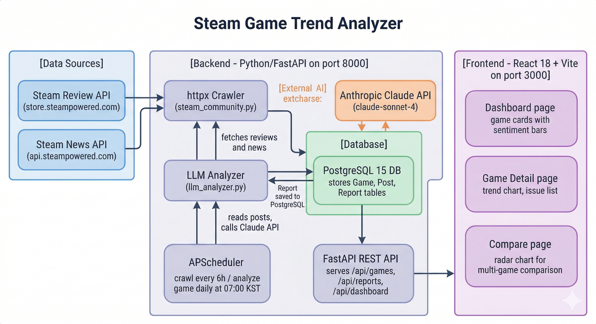
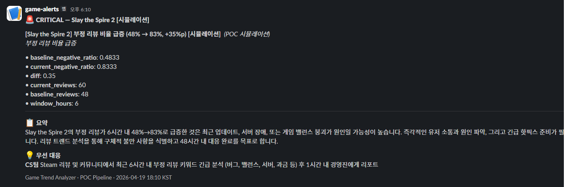

[](README.md)
[](README-en.md)

# Game Trend Analyzer (GTA)
### 게임 동향 기상청

A live ops dashboard that collects and analyzes reviews, community posts, and store data across 10 Steam PC games and 10 mobile games — from Steam, Reddit, Google Play, and App Store — giving game operators, designers, and marketers an at-a-glance view of community trends.

## Tech Stack


## Requirements

- Docker & Docker Compose
- Anthropic API Key

## Getting Started

```bash
# 1. Configure environment variables
cp .env.example .env
# Open .env and fill in ANTHROPIC_API_KEY and other values

# 2. Start all services
docker-compose up --build

# 3. Access
# Dashboard:  http://localhost:3000
# Swagger UI: http://localhost:8000/docs
```

## Environment Variables

| Variable | Description | Default |
|----------|-------------|---------|
| `POSTGRES_USER` | PostgreSQL username | gametrend |
| `POSTGRES_PASSWORD` | PostgreSQL password | changeme |
| `POSTGRES_DB` | PostgreSQL database name | gametrend_db |
| `DATABASE_URL` | DB connection URL | postgresql://... |
| `ANTHROPIC_API_KEY` | Anthropic API key | - |
| `CRAWL_INTERVAL_HOURS` | Crawl interval (hours) | 6 |
| `ANALYZE_INTERVAL_HOURS` | Analysis interval (hours) | 24 |

## Key API Endpoints

| Endpoint | Description |
|----------|-------------|
| `GET /api/games` | List all games |
| `GET /api/reports/{game_id}` | Reports for a specific game |
| `GET /api/reports/{game_id}/latest` | Latest report |
| `GET /api/dashboard/summary` | Dashboard summary |
| `GET /api/compare` | Compare games |
| `POST /api/admin/trigger-crawl` | Manual crawl trigger |
| `POST /api/admin/trigger-analyze` | Manual analysis trigger |

## System Architecture



## Slack Alert Example

A CRITICAL alert automatically sent to the team channel when an anomaly is detected.



## Sample Reports

The [`reports/`](./reports/) folder contains real output reports from actual runs.

| Date | Type | Link |
|------|------|------|
| 2026-04-11 | Trend Report | [View rendered page →](https://raw.githack.com/hebinalee/game-trend-analyzer/master/reports/steam-trend-2026-04-11.html) |
| 2026-04-19 | Team Agent POC (Slay the Spire 2) | [View rendered page →](https://raw.githack.com/hebinalee/game-trend-analyzer/master/reports/poc-pipeline-2026-04-19-slay-the-spire-2.html) |

> **Trend Report**
> ```bash
> python scripts/generate_report.py
> # Output: reports/steam-trend-YYYY-MM-DD.html
> ```
>
> **Team Agent POC**
> ```bash
> # Install dependencies (first time only)
> pip install -r scripts/requirements.txt
>
> # Top 10 default mode
> python scripts/poc_pipeline.py
> # Output: reports/poc-pipeline-YYYY-MM-DD.html
>
> # Custom game mode (main game + similar genre analysis)
> python scripts/poc_pipeline.py --game "Elden Ring"
> # Output: reports/poc-pipeline-YYYY-MM-DD-elden-ring.html
> ```

## Collected Data

| Type | Source | Content |
|------|--------|---------|
| `review` | Steam Review API | User recommendations/rejections + review text |
| `news` | Steam News API | Official patch notes and update announcements |

## Schedule

- Crawling: Runs automatically every 6 hours (with an immediate first run 1 minute after app start)
- Analysis: Runs automatically every day at 07:00 KST

## Development History

Key design decisions and development progress are documented in the log below.

[Developer Log →](docs/history/en.md)
